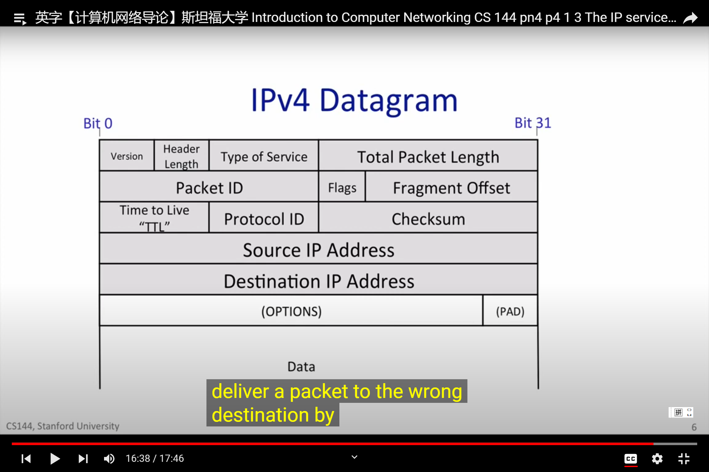

### IP service

IP datagram:IP data+IP header
IP data包含了传输层的data和头部

IP datagram整个在Link Data中,Link Frame 包含data和header

Properties:
- Datagram:Individually routed packets, hop-by-hop routing
    - IPDA: 目标地址
    - IPSA: 源地址
路由的 Forwarding decision取决于IPDA。 
IPSA用于发送回复
We will learn more about how routers work later but for now its enough to know that each router contains a forwarding table that tells it where to send packets next after it matches a given destination address.
可以将router比喻成信件被邮寄的过程

- Unreliable
packet 可能被 misbehaving router 复制.
- Best effort... but only if necessary.
可能由于网络拥堵，router不得不丢下寄来的数据包.这不会被告知，也不会被寄出。
- Connectionless
It doesn't start by establishing some end-to-end state associated with the communication

Why is IP service so simple?
IP是互联网的基础。Every communication over the internet users must use IP service.

- Simple, dumb, minimal: Faster, more stramlined and lower cot to build and maintain.
- The end-to-end principle: Where possible, implement features in the end hosts.
- Allows a variety of reliable/unreliable services to be built on top.
- Works over any link layer: IP makes very few assumptions about the link layer below.
carrier pigeons? There's even an internet standard telling you how to do it!

### IP Service Model
1. Tries to prevent packets looping forever.
hop count, time to live/ttl. Initial start number ,decrement, delete when reaches 0.
2. Will fragment packets if they are too long.
IP provides some header fields that we'll see in a minute, to help the router fragment the datagram into two self-contained ip datagrams while providing the information the in-host needs to correctly reassemble the data again.
3. Use a header checksum th reduce chances of delivering datagram to wrong destination
4. Allows for new versions of IP
    - IPv4(32b)
    - IPv6(128b)
5. Allows for new options to be added to the header.

### IPv4 Datagram

IPDA,IPSA,
Protocol ID:What is inside the data field,allows the dest demultiplex arriving data, sending them to the correct to process the packet. e.g.6: A TCP segment, and so we can safely pass the datagram to TCP code 
140+ types of Protocol ID

Version: IPv4/IPv6
Total Packet Length: at most 64kb including the header.
TTL:prevent looping
Packet ID,Flags,Fragment Offset: fragmentation when too long 
Types of service: Hint of the importance of the packets
Header length: If there is Extra filds
Checksum: check if the header is corrupted.

